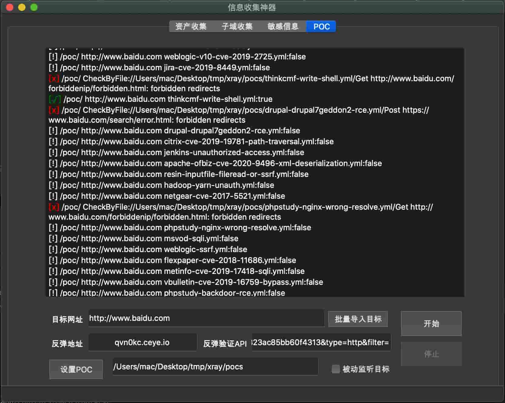

# DarkEye

DarkEye项目旨为收集目标信息，如实反馈结果，无主观判断。DarkEye从互联网（SecurityTrails、FoFa、google）收集情报或目标公开的接口信息，仅做汇总并不做分析，本项目不具备攻击性，漏洞的利用主要依靠人或其它工具来支撑。

TODO LIST
===
```$xslt
* 增加POC检测被动模式
```

支持平台
===
|系统 |状态|
|--------------------------|----------------|
|MacOs | 支持|
|Linux | 支持|
|Windows | 支持|


支持功能
===
|功能 |描述|
|--------------------------|----------------|
|收集C段资产 | 输入IP后通过**FoFa**自动收集资产信息（**免key**），同时**判断收集资产有效性**，若有其它好途径请留言会增加;收集的结果会自动保存csv格式|
|收集子域 | 通过**SecurityTrails**收集子域名，并扩展支持提取**域名解析的ip、cname、地域、标题**; 需要使用key建议官网申请2-3个（50个域名/1key）;收集的结果自动保存为csv格式|
|敏感接口 | 爬取网站（含js、html、xml、json等）贪婪搜索返回内容中任何位置可能存在的接口路径; 敏感路径分级; 数据保存为csv|
|端口扫描 | 支持扫IP，IP范围扫描、**支持获取标题和中间件**、支持端口范围和指定端口扫描（默认为常用端口）、**绕过防火墙频率限制扫描（仅支持单IP）**;收集结果自动保存为csv格式|
|POC扫描 | 支持xray poc格式 https://github.com/chaitin/xray/tree/master/pocs,https://github.com/Laura0xiaoshizi/xray_pocs|


功能截图
===
端口扫描

主界面

POC扫描



安装
===

##### QT环境

```qt
参考: https://github.com/therecipe/qt/wiki/Installation
```

##### Build Windows/macOS/Linux

```golnag
go get github.com/zsdevX/DarkEye
./build mac
./build linux
./build win
编译好后文件都自动发布到dist目录下

```

