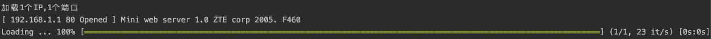

# DarkEye

DarkEye项目旨为收集目标信息。DarkEye从互联网（SecurityTrails、fofa、github等）收集情报或目标公开的接口信息，仅做汇总并不做分析，本项目不具备攻击性，漏洞的利用主要依靠人或其它工具来支撑。


支持平台
===
|系统 |状态|
|--------------------------|----------------|
|MacOs | 支持|
|Linux | 支持|
|Windows | 支持|


支持功能
===
|功能 |描述|
|--------------------------|----------------|
|收集C段资产 | 使用IP通过fofa自动收集（**无需key**），并**判断收集资产有效性**，若有其它好途径请留言会增加|
|收集子域 | 通过SecurityTrails收集子域名，并支持自动**域名解析ip、cname、地域、标题**; 需要使用key建议官网申请2-3个（50/1个）|
|敏感接口 | 爬取网站（含js、html、xml、json等）贪婪搜索返回内容中任何位置可能存在的接口路径|
|端口扫描 | 支持扫C段，单IP扫描、**支持获取标题和中间件**、支持端口范围和指定端口扫描、**互联网绕过防火墙频率限制扫描**（绕过防火墙限制扫描目前仅支持单IP）|




功能使用
===
|功能 |描述|
|--------------------------|----------------|
|收集C段资产| UI操作方式，直接运行**DarkEye**即可|
|收集子域| UI操作方式，直接运行**DarkEye**即可|
|敏感接口| UI操作方式，直接运行**DarkEye**即可|
|端口扫描 | 命令行运行： **portscan -h**可查看帮助|


安装
===

##### QT环境

```qt
参考: https://github.com/therecipe/qt
```

##### Build Windows/macOS/Linux

```golnag
go get github.com/zsdevX/DarkEye
./build mac
./build linux
./build win
编译好后文件都自动发布到dist目录下

```

