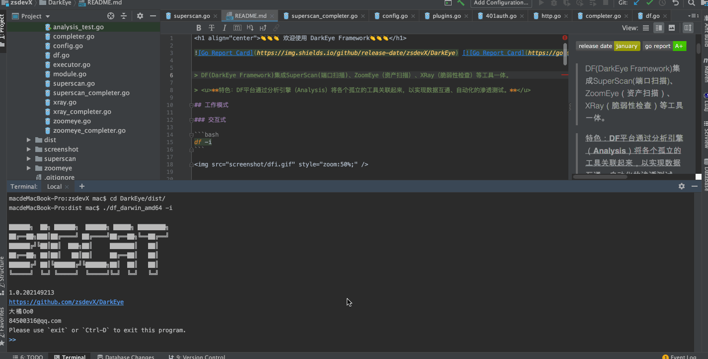
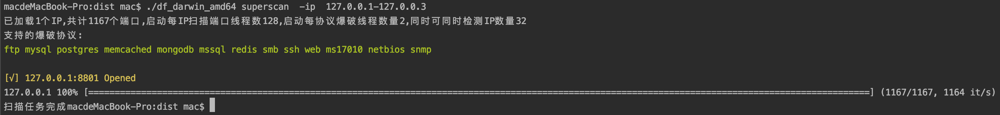
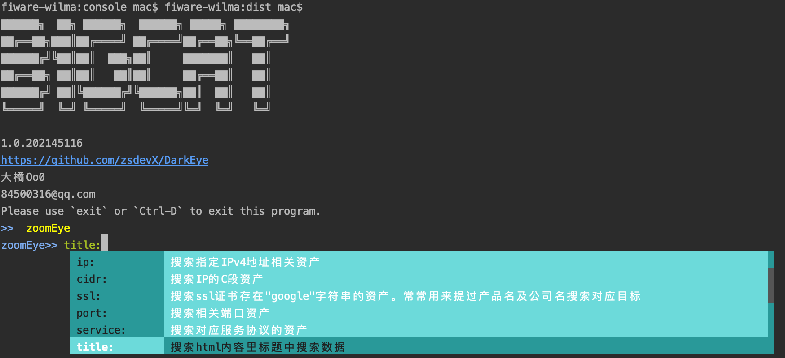
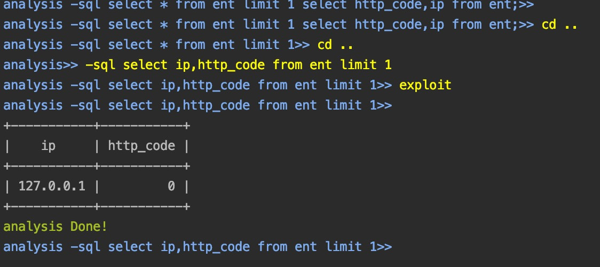

<h1 align="center">👏👏👏 欢迎使用 DarkEye Framework👏👏👏</h1>

 [](https://goreportcard.com/report/github.com/zsdevX/DarkEye)


> DF(DarkEye Framework)集成SuperScan(端口扫描)、ZoomEye（资产扫描）、XRay（脆弱性检查）等工具一体。

> <u>**特色：DF平台通过分析引擎（Analysis）将各个孤立的工具关联起来，以实现数据互通、自动化的渗透测试。**</u>

## 工作模式

### 交互式

```bash
df -i
```




### 非交互式

```bash
查看帮助:
df [moduleId]
		Tips: moduleId = 【superScan,zoomEye,analysis】
```

## 模块介绍

### SuperScan
- 扫描目标灵活配置

- 支持活跃网段、主机检测

- 支持常用协议弱口令爆破

- 支持获取标题和中间件

- 支持绕过防火墙频率限制扫描（仅单个IP有效）

  

🚀快速使用 

1. 查看帮助
```bash
./df supercan
```
2. 口令爆破+资产识别
```bash
./df supercan -ip 192.168.1.1-192.168.255.255
```
3. 活跃主机检查
```bash
仅检查网段
./df supercan -ip 192.168.1.1-192.168.255.255 -only-alive-network
检查所有主机
./df supercan -ip 192.168.1.1-192.168.255.255 -only-alive-host
```

### ZoomEye
- https://www.zoomeye.org/

|  | 提供商   | 申请地址 | 数量 |
| ----- | --------- | ----------- | ------- |
| 1 | ZoomEye |   https://www.zoomeye.org/profile          |    每月免费1w/资源     |

#### 🚀快速使用 


### Analysis

* 数据统一存储`analysis.s3db`
* ***SQL查询语法***
#### 🚀快速使用  


## 支持平台

```
Windows、Linux、MacOs、Arm、Mips[el]、FreeBsd ...
```


## 🛠 编译安装

```bash
git clone https://github.com/zsdevX/DarkEye.git
cd DarkEye
./build all

Tips:编译好后文件都自动发布到dist目录下
```

# 404StarLink 2.0 - Galaxy


DarkEye 是 404Team [星链计划2.0](https://github.com/knownsec/404StarLink2.0-Galaxy)中的一环，如果对DarkEye 有任何疑问又或是想要找小伙伴交流，可以参考星链计划的加群方式。

- [https://github.com/knownsec/404StarLink2.0-Galaxy#community](https://github.com/knownsec/404StarLink2.0-Galaxy#community)


