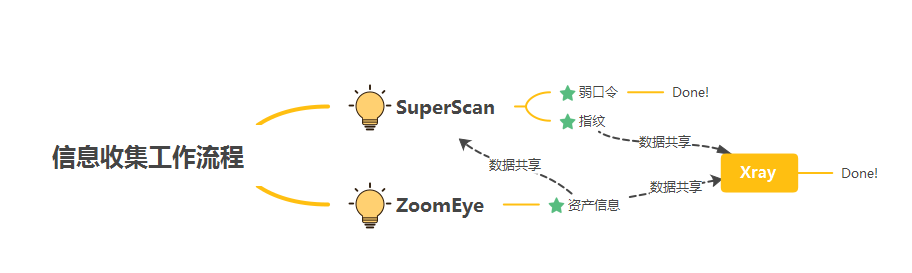

<h1 align="center">👏👏👏 欢迎使用 DarkEye Framework👏👏👏</h1>

 [](https://goreportcard.com/report/github.com/zsdevX/DarkEye)


> DF(DarkEye Framework)集成SuperScan(弱口令扫描)、ZoomEye（资产扫描）、XRay（脆弱性检查）等工具一体。

> <u>**特色：DF平台通过分析引擎（Analysis）将各个孤立的工具关联起来，以实现数据互通、自动化的渗透测试。**</u> 




## Demo


## 🚀快速使用 

### 启动

```bash
df -i
```

## 模块介绍

### SuperScan

| 功能               | 支持                                                         |
| ------------------ | ------------------------------------------------------------ |
| 弱口令爆破         | netbios snmp postgres redis web `rdp` ssh ftp memcached mongodb mssql mysql smb |
| 存活主机、网段检测 |                                                              |
| web指纹            | title、server、url                                           |
| 绕频率限制扫端口   | 限单ip                                                       |

### ZoomEye

- https://www.zoomeye.org/

|      | 提供商  | 申请地址                        | 数量 |
| ---- | ------- | ------------------------------- | ---- |
| 1    | ZoomEye | https://www.zoomeye.org/profile |      |

### Analysis

| 功能    | 支持                                               |
| ------- | -------------------------------------------------- |
| 存储    | 历史记录保存在analysis.s3db, 支持`sqlite3`查询语法 |
| 导出csv | `-output-csv`可将查询的结果导出csv格式             |

## 高级使用

### 变量

| 变量名 | 说明                                                         |
| ------ | ------------------------------------------------------------ |
| $IP    | 对应资产扫描后数据库`ent`中的`ip`字段，选择后模块将自动使用数据库中的ip进行渗透 |
| $URL   | 对应资产扫描后数据库`ent`中的`url`字段，选择后模块将自动使用数据库中的url进行渗透 |

### 数据查询

| 功能 | 描述                                                      |
| ---- | --------------------------------------------------------- |
| F1   | 单模块执行任务时，输入`F1`可实时查看结果                  |
| -sql | analysis模块的-sql参数可以执行`sqlite3`语法，方便检索数据 |


## 支持平台

```
Windows、Linux、MacOs、Arm、Mips[el]、FreeBsd ...
```


## 🛠 编译安装

```bash
# https://github.com/zsdevX/freerdp_binary
git clone https://github.com/zsdevX/DarkEye.git
cd DarkEye
./build all

Tips:编译好后文件都自动发布到dist目录下
```

## 问题汇总
* zoomEye、xRay这些工具需要自己下载吗？

  > 不需要，`df`会自动从默认地址下载。 

* 使用x-Ray提示license错误

  > 需要大佬自己搞到高级学习版[旺柴]

* 是否支持非图形界面

  > 支持存命令模式已适应不通的渗透场景，每个模块可以独立使用，以superscan为例：
  >
  > ```df superscan -h```

# 404StarLink 2.0 - Galaxy


DarkEye 是 404Team [星链计划2.0](https://github.com/knownsec/404StarLink2.0-Galaxy)中的一环，如果对DarkEye 有任何疑问又或是想要找小伙伴交流，可以参考星链计划的加群方式。

- [https://github.com/knownsec/404StarLink2.0-Galaxy#community](https://github.com/knownsec/404StarLink2.0-Galaxy#community)


