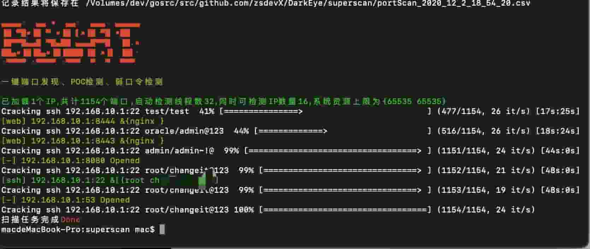
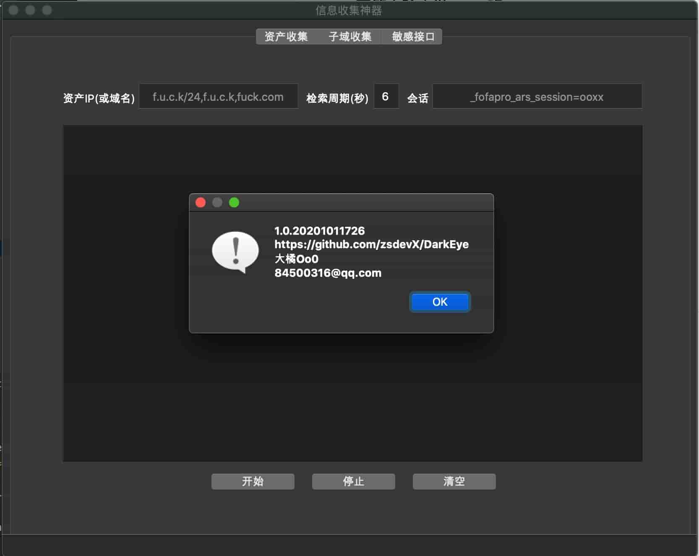

<h1 align="center">👏👏👏 欢迎使用 DarkEye 👏👏👏</h1>

> 从互联网收集目标信息，如实反馈结果。

> 资产弱口令、脆弱性检查。

## 功能介绍

### 超级扫描
- 支持范围扫描（IP、端口）。
- 支持活跃网段、主机。
- 常用协议弱口令爆破。
- 支持获取标题和中间件。
- 绕过防火墙频率限制扫描（限单IP）。
- 支持长亭xray官方poc解析，poc文件可从下列列表白嫖：
    https://github.com/chaitin/xray/tree/master/pocs
    https://github.com/Laura0xiaoshizi/xray_pocs
- csv格式报告导出。

#### 🚀快速使用 
1. 查看帮助
```bash
./supercan  -h
```
2. 口令爆破+脆弱性检查
```bash
./supercan  -ip 192.168.1.1-192.168.255.255
```
3. 活跃网段检测
```bash
./supercan  -ip 192.168.1.1-192.168.255.255 -only-check-alive
```
4. 活跃主机检查（仅C段）
```bash
./supercan  -ip 192.168.1.1 -only-check-alive
```
5. Poc测试
```bash
cd superscan/util
go build poc.go
./poc -test -test-poc ../db_poc/shiro.yml -test-url http://www.baidu.com
```
#### ✨ Demo


### 互联网信息搜集
- 支持从zoomEye（需key）、FoFa（免key）收集资产信息。
- 支持子域爆破、SecurityTrails收集子域信息，并扩展支持提取域名解析的ip、cname、地域、标题。（50个域名/1key，多申请:))
- 爬取网站（含js、html、xml、json等）贪婪搜索返回内容中任何位置可能存在的接口路径; 敏感路径分级;
- 支持google hack爬取数据，无需翻墙但是需要到https://serpstack.com/申请key（1key/100次/每月, 多申请:)）
- csv格式报告输出  

#### ✨ Demo
主界面



## 支持平台
全平台


## 🛠 编译安装

### QT环境
'信息搜集'的图形界面部分采用qt，需安装qt支持库。
```qt
参考: https://github.com/therecipe/qt/wiki/Installation
```

### 互联网信息搜集
```golnag
go get github.com/zsdevX/DarkEye
./build mac
./build linux
./build win
编译好后文件都自动发布到dist目录下
```

### 超级扫描
```golang
go get github.com/zsdevX/DarkEye
cd superscan
./build all
```

# 404StarLink 2.0 - Galaxy


DarkEye 是 404Team [星链计划2.0](https://github.com/knownsec/404StarLink2.0-Galaxy)中的一环，如果对DarkEye 有任何疑问又或是想要找小伙伴交流，可以参考星链计划的加群方式。

- [https://github.com/knownsec/404StarLink2.0-Galaxy#community](https://github.com/knownsec/404StarLink2.0-Galaxy#community)


